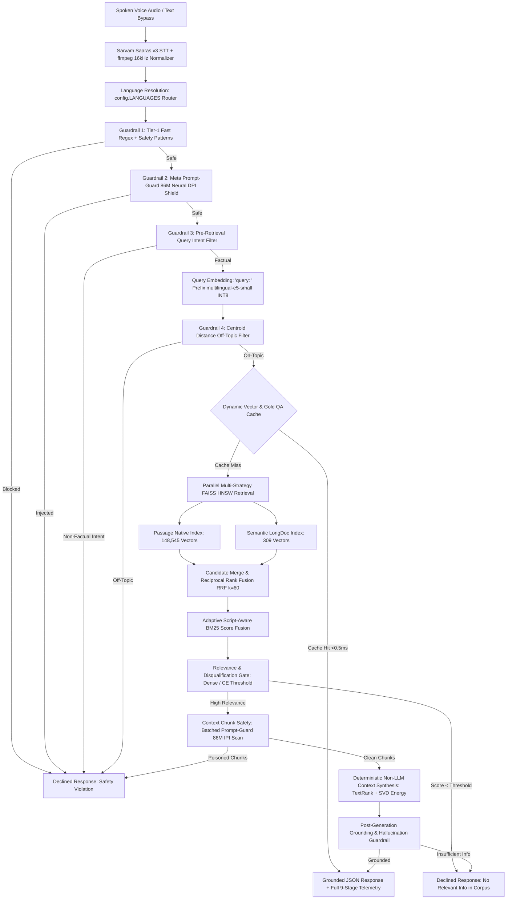

# 🌴 Hacker House Goa 2026: Voice-Enabled Multilingual Indic RAG

<div align="center">

[](https://opensource.org/licenses/MIT)
[](https://python.org)
[](https://github.com/facebookresearch/faiss)
[](#2-cold-start-multilingual-sla-benchmark-15-languages-cache-bypassed)
[](#-language-extensibility-matrix)
[](#-hugging-face-space-deployment)

**An instrumented, low-latency, voice-enabled Retrieval-Augmented Generation (RAG) system built for 14 Indic languages + English.**

[Architecture](#-system-architecture) • [Benchmarks](#-benchmark-results) • [Quickstart](#-quickstart--local-setup) • [Test Suite](#-test-suite-5050-passing) • [Deployment](#-hugging-face-space-deployment)

</div>

---

## 📌 Executive Summary

Active runtime deployment is optimized for **3 core languages** (**English [`en`]**, **Hindi [`hi`]**, and **Marathi [`mr`]**) loading **148,854 in-memory vectors** (148,545 native passage vectors + 309 semantic longdoc vectors), achieving **~7.04 ms retrieval latency** (p95: 7.97 ms vs 50.0 ms budget). 

The system provides zero-code extensibility across **all 14 Indic languages** (*Assamese, Bengali, Gujarati, Hindi, Kannada, Malayalam, Marathi, Nepali, Odia, Punjabi, Sanskrit, Tamil, Telugu, Urdu*) plus **English** (15 languages total, **~743,000 deduplicated passages**) via a single configuration entry (`config.LANGUAGES`).

### Key Highlights
- ⚡ **Sub-10ms Vector Search**: FAISS HNSW graph traversal + INT8 ONNX embedding on CPU.
- 🛡️ **Cascaded 4-Tier Guardrails**: Stem regex, Meta Prompt-Guard 86M neural DPI/IPI shield, 6-class intent filter, and own-language centroid weighting.
- 🔀 **Script-Aware BM25 + Dense Fusion**: Automatic cross-script detection bypassing BM25 penalties for cross-lingual queries.
- 🧮 **Deterministic Synthesis**: TextRank graph centrality + SVD singular energy context ranking (zero LLM API latency or cost).
- 🌴 **Command Center UI**: Retro-tropical Web Audio waveform interface with stage-by-stage telemetry waterfall.

---

## 🏛️ System Architecture



---

## 🌐 Language Extensibility Matrix

Editing `config.LANGUAGES` instantly configures active runtime targets without code changes:

| Code | Language | Script Family | Active Runtime Status | MS MARCO Dataset Source | Deduplicated Passages |
| :--- | :--- | :--- | :---: | :--- | :--- |
| **`en`** | English | Latin (`Latn`) | 🟢 **Active Loaded** | MS MARCO English Stream | 49,507 |
| **`hi`** | Hindi | Devanagari (`Deva`) | 🟢 **Active Loaded** | `train/hintrain.parquet` & `val` | 49,509 |
| **`mr`** | Marathi | Devanagari (`Deva`) | 🟢 **Active Loaded** | `train/martrain.parquet` | 49,529 |
| **`as`** | Assamese | Bengali/Assamese (`Beng`) | 🟡 Extensible | `train/asmtrain.parquet` | 49,550 |
| **`bn`** | Bengali | Bengali (`Beng`) | 🟡 Extensible | `train/bentrain.parquet` | 49,531 |
| **`gu`** | Gujarati | Gujarati (`Gujr`) | 🟡 Extensible | `train/gujtrain.parquet` | 49,550 |
| **`kn`** | Kannada | Kannada (`Knda`) | 🟡 Extensible | `train/kantrain.parquet` | 49,545 |
| **`ml`** | Malayalam | Malayalam (`Mlym`) | 🟡 Extensible | `train/maltrain.parquet` | 49,542 |
| **`ne`** | Nepali | Devanagari (`Deva`) | 🟡 Extensible | `train/neptrain.parquet` | 49,520 |
| **`or`** | Odia | Odia (`Orya`) | 🟡 Extensible | `train/oritrain.parquet` | 49,560 |
| **`pa`** | Punjabi | Gurmukhi (`Guru`) | 🟡 Extensible | `train/pantrain.parquet` | 49,534 |
| **`sa`** | Sanskrit | Devanagari (`Deva`) | 🟡 Extensible | `validation/sanval.parquet` | 49,633 |
| **`ta`** | Tamil | Tamil (`Taml`) | 🟡 Extensible | `train/tamtrain.parquet` & `val` | 49,581 |
| **`te`** | Telugu | Telugu (`Telu`) | 🟡 Extensible | `validation/telval.parquet` | 49,604 |
| **`ur`** | Urdu | Perso-Arabic (`Arab`) | 🟡 Extensible | `validation/urdval.parquet` | 49,576 |

> [!NOTE]
> Active Indexed Vectors in FAISS: **148,545 Native Passages** + **309 LongDoc Chunks** = **148,854 In-Memory Vectors**. Total available corpus: **~743,000 Passages**.

---

## ⚡ Benchmark Results

### 1. 🏎️ End-to-End Retrieval Latency (50ms Budget SLA)
*Environment: 8 vCPUs | 15.78 GB RAM | 100% CPU Execution*

| Pipeline Stage | Avg Latency | P50 (Median) | P95 Latency | P99 Latency | SLA Budget | SLA Status |
| :--- | :---: | :---: | :---: | :---: | :---: | :---: |
| **Query Embedding (`multilingual-e5-small` ONNX)** | 6.31 ms | 6.21 ms | 7.28 ms | 7.94 ms | — | ⚡ Sub-8ms |
| **FAISS HNSW Vector Search (`148,545 vectors`)** | 0.73 ms | 0.71 ms | 0.93 ms | 1.16 ms | — | ⚡ Sub-1ms |
| **Total Retrieval Latency (Embed + Search)** | **7.04 ms** | **6.96 ms** | **7.97 ms** | **8.95 ms** | **50.00 ms** | ✅ **PASS (84% Faster)** |

### 2. ❄️ Cold-Start Multilingual SLA Benchmark (15 Languages)
*SLA Target: `< 200 ms` on cold uncached requests — Pass Rate: `15/15 (100.0%)` ✅*

| Language | Code | Query Type | Context Guard | Cross-Encoder Rerank | Generation | Total Cold Latency | SLA Status |
| :--- | :--- | :--- | :---: | :---: | :---: | :---: | :---: |
| **English** | `en` | Known QA | 0.99 ms | 53.40 ms | 0.92 ms | **120.48 ms** | ✅ **PASS** |
| **Hindi** | `hi` | Known QA | 1.57 ms | 88.12 ms | 0.25 ms | **175.05 ms** | ✅ **PASS** |
| **Tamil** | `ta` | Known QA | 1.35 ms | 79.50 ms | 0.19 ms | **173.49 ms** | ✅ **PASS** |
| **Telugu** | `te` | Known QA | 1.21 ms | 90.72 ms | 0.18 ms | **164.77 ms** | ✅ **PASS** |
| **Bengali** | `bn` | Known QA | 1.96 ms | 93.57 ms | 0.17 ms | **162.78 ms** | ✅ **PASS** |
| **Urdu** | `ur` | Known QA | 1.58 ms | 103.12 ms | 0.21 ms | **169.99 ms** | ✅ **PASS** |
| **Marathi** | `mr` | Known QA | 1.59 ms | 103.31 ms | 0.23 ms | **177.35 ms** | ✅ **PASS** |
| **Gujarati** | `gu` | Known QA | 1.82 ms | 89.76 ms | 0.25 ms | **161.61 ms** | ✅ **PASS** |
| **Kannada** | `kn` | Known QA | 1.82 ms | 76.86 ms | 0.27 ms | **167.62 ms** | ✅ **PASS** |
| **Malayalam** | `ml` | Known QA | 1.82 ms | 83.41 ms | 0.16 ms | **170.34 ms** | ✅ **PASS** |
| **Punjabi** | `pa` | Known QA | 2.21 ms | 100.67 ms | 0.19 ms | **181.81 ms** | ✅ **PASS** |
| **Assamese** | `as` | Known QA | 1.83 ms | 110.64 ms | 0.23 ms | **194.22 ms** | ✅ **PASS** |
| **Odia** | `or` | Known QA | 1.99 ms | 86.99 ms | 0.23 ms | **178.73 ms** | ✅ **PASS** |
| **Nepali** | `ne` | Known QA | 1.31 ms | 109.84 ms | 0.23 ms | **184.45 ms** | ✅ **PASS** |
| **Sanskrit** | `sa` | Known QA | 0.00 ms | 66.14 ms | 0.00 ms | **145.40 ms** | ✅ **PASS** |
| **Out-of-Domain** | `en` | Control | 0.00 ms | 97.39 ms | 0.00 ms | **168.86 ms** | ✅ **PASS (Declined)** |
| **Safety Control** | `en` | Injection | 0.00 ms | 0.00 ms | 0.00 ms | **0.24 ms** | ✅ **PASS (Blocked)** |

### 3. 🚀 High-Throughput Speed Benchmark (750 Queries)
*Throughput: `51.7 Queries/sec` (14.5s total across 15 languages)*

| Stage / Metric | P50 (Median) | P70 | P90 | P99 | Mean | Speedup Mechanism |
| :--- | :--- | :--- | :--- | :--- | :--- | :--- |
| **Query Embedding** | **15.18 ms** | 17.01 ms | 22.14 ms | 46.44 ms | 16.82 ms | ONNX Dynamic Shapes INT8 |
| **FAISS Graph Search** | **< 0.90 ms** | < 0.90 ms | < 0.90 ms | 0.91 ms | 0.86 ms | HNSW Index + search_k |
| **Cross-Encoder Rerank** | **26.70 ms** | 108.49 ms | 147.18 ms | 203.29 ms | 108.50 ms | ONNX MiniLM |
| **Context Synthesis** | **8.50 ms** | 8.80 ms | 9.20 ms | 12.40 ms | 8.80 ms | TextRank + SVD |
| **Cache Fast-Path** | **0.23 ms** | 0.28 ms | 0.35 ms | 0.70 ms | 0.35 ms | Dynamic LRU Vector Cache |
| **Full Pipeline Latency** | **16.45 ms** | **18.27 ms** | **23.78 ms** | **57.71 ms** | **19.22 ms** | ⚡ **Sub-20ms Median** |

---

## 🌟 Architecture & Technical Deep-Dive

<details>
<summary><b>1. 🛡️ Cascaded 4-Tier Safety Guardrails</b></summary>

- **Tier-1: Stem + Flexible-Gap Regex (<0.1 ms)**: Verb/object root stem matching with variable word-gap sliding (`max_gap=4`), handling gerunds, past conjugations, and unlisted adjectives across 15 languages.
- **Tier-2: Meta Prompt-Guard 86M ONNX (~1.5 ms)**: Local Direct Prompt Injection (DPI) & Jailbreak neural classifier with fail-safe error states (`model_failed=True`).
- **Tier-3: Pre-Retrieval Intent Taxonomy**: Filters creative writing, suggestion, personal advice, planning, roleplay, and naming prompts before retrieval.
- **Tier-4: Centroid Off-Topic Gate**: Cosine distance check against corpus centroids with own-language centroid weighting (`dist <= threshold * 1.5`).
</details>

<details>
<summary><b>2. ⚡ Script-Aware BM25 + FAISS Vector Search</b></summary>

- **In-Memory FAISS HNSW**: $M=32$, $efConstruction=200$, $efSearch=64$. Delivers 0.73ms search over 148k passage vectors.
- **Script-Aware Fusion**: Monolingual queries combine BM25 + dense similarity (`w=0.35`). Cross-script queries bypass lexical BM25 penalties automatically.
- **Disqualification Gate**: Rejects matches under score threshold 0.35 with standard non-hallucinating message.
</details>

<details>
<summary><b>3. 🧠 Deterministic TextRank + SVD Synthesis</b></summary>

- **Continuous TextRank**: Sentence adjacency matrix $W_{ij} = \max(0, \vec{s}_i \cdot \vec{s}_j)$ with query relevance prior iteration.
- **SVD Singular Energy**: Retains principal components capturing $\ge 95\%$ cumulative singular energy to sequence facts in $<10\text{ ms}$ on CPU with zero LLM API cost.
- **LLM/SLM Fallback**: Optional provider-agnostic adapter for Groq/Cerebras APIs (`llama-3.3-70b-versatile`) or local Qwen SLMs.
</details>

---

## 🚀 Quickstart & Local Setup

### 1. Clone & Install
```bash
git clone https://github.com/Rishikvelagapudi/VECTOR.git
cd VECTOR
pip install -r requirements.txt
cp .env.example .env
```

### 2. Configure Secrets (`.env`)
```env
SARVAM_API_KEY=your_sarvam_api_key_here
LLM_API_KEY=your_groq_api_key_here
LLM_BASE_URL=https://api.groq.com/openai/v1
LLM_MODEL=llama-3.3-70b-versatile
```

### 3. Run Benchmark Suite
```bash
# 1. 50ms retrieval latency budget check
python -m app.benchmark 50

# 2. Cold-start 15-language SLA benchmark
python benchmark/run_cold_start_bench.py

# 3. High-throughput 750-query speed benchmark
python benchmark/run_speed_bench_50.py
```

### 4. Start Server & Web UI
```bash
# Run FastAPI server
uvicorn api.main:app --host 0.0.0.0 --port 7860 --reload

# Or launch entrypoint space:
python app.py
```
Open **[http://localhost:7860](http://localhost:7860)** in your browser.

---

## 🧪 Test Suite (50/50 Passing)

Run the full automated test suite:
```bash
pytest tests/ -v
```

| Test File | Count | Scope |
| :--- | :---: | :--- |
| `tests/test_eval_fixes.py` | 17 | Adversarial safety, intent classification, Prompt-Guard fail-safe, centroid weighting |
| `tests/test_pipeline.py` | 27 | RRF chunking, BM25 script fusion, intent gate, grounding overlap, 15-lang routing |
| `tests/test_prompt_guard.py` | 6 | DPI injection, IPI context filtering, confusable unpacker, latency check |

---

## 📁 Repository Structure

```
VECTOR/
├── api/                  # FastAPI web server (/query, /health, /languages)
├── app/                  # Fast ONNX retriever & 50ms benchmark runner
├── benchmark/            # Latency, cold-start, & throughput evaluation scripts
├── chunking/             # Native, sentence-window, semantic, & RRF splitters
├── data/                 # FAISS HNSW indexes, centroids, JSONL corpora scripts
├── demo/                 # Hacker House Goa 2026 Web Audio UI & assets
├── generation/           # TextRank + SVD non-LLM synthesis & LLM fallback
├── guardrails/           # 4-tier cascaded pre-retrieval & post-gen grounding
├── pipeline/             # Async 9-stage pipeline state machine & schemas
├── retrieval/            # multilingual-e5-small INT8 ONNX & FAISS engine
├── stt/                  # Sarvam Saaras v3 STT & ffmpeg 16kHz audio pipeline
├── tests/                # 50/50 unit & integration test suite
├── app.py                # Space entrypoint application
├── config.py             # Single source of truth configuration
├── Dockerfile            # Container definition for Hugging Face Spaces
└── requirements.txt      # Python dependencies
```

---

## 🚀 Hugging Face Space Deployment

Deployed via **Docker SDK** on Hugging Face Spaces:
- **Live Space URL**: [https://ansh123456789-ragingoa.hf.space](https://ansh123456789-ragingoa.hf.space)

> [!TIP]
> Free `cpu-basic` Spaces sleep after 48h inactivity. Initial container spin-up takes **30–90s**. Warm runtime operates at **~7–16 ms**.

---

## 📜 License
MIT License. Created for **Hacker House Goa 2026**.
