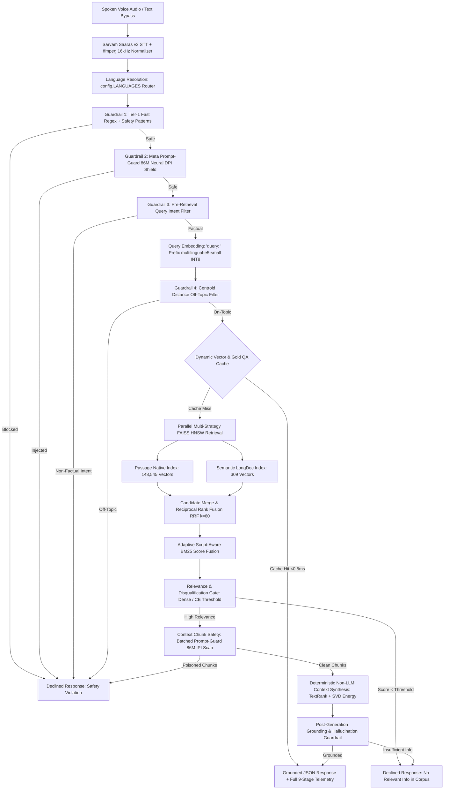

# 🌴 Hacker House Goa 2026: Voice-Enabled Multilingual Indic RAG

An instrumented, low-latency, voice-enabled Retrieval-Augmented Generation (RAG) system built from scratch for **Indic languages** and **English**, strictly architected for zero-code extension via a single configuration list (`config.LANGUAGES`).

Active runtime deployment is optimized for **3 core languages** (**English [`en`]**, **Hindi [`hi`]**, and **Marathi [`mr`]**) with **148,854 in-memory vectors** (148,545 native passage vectors + 309 semantic longdoc vectors) achieving **~7.04 ms retrieval latency** (p95: 7.97 ms vs 50.0 ms budget), with zero-code extensibility across **all 14 Indic languages** (**Assamese, Bengali, Gujarati, Hindi, Kannada, Malayalam, Marathi, Nepali, Odia, Punjabi, Sanskrit, Tamil, Telugu, Urdu**) and **English** (15 languages total, **~743,000 deduplicated passages**).

Featuring **Cross-Lingual Multilingual Federation**, **Cascaded 4-Tier Pre-Retrieval Safety Guardrails**, **Meta Prompt-Guard 86M Neural DPI/IPI Shields**, **Script-Aware BM25 + Dense Hybrid Fusion**, **Deterministic Continuous TextRank + SVD Context Synthesis**, and a retro-tropical **Hacker House Goa 2026 Command Center UI**.

---

## 🏛️ System Architecture



---

## 🌐 Language Extensibility Matrix (Active Runtime vs 15-Language Extensibility)

The pipeline uses `config.LANGUAGES` as the single source of truth for active languages. The deployed space active runtime loads **English (`en`)**, **Hindi (`hi`)**, and **Marathi (`mr`)** into in-memory FAISS HNSW indexes (148,854 total vectors) for sub-10ms retrieval latency and lean RAM footprint. The codebase includes pre-processed corpora and metadata for all **14 Indic languages + English** (~743,000 passages), extensible with zero code changes by editing `config.LANGUAGES`:

| Language Code | Language Name | Script Family | Active Runtime Status | MS MARCO Dataset Source | Deduplicated Passages |
| :--- | :--- | :--- | :---: | :--- | :--- |
| **`en`** | English | Latin (`Latn`) | 🟢 **Active Loaded** | MS MARCO English Stream | 49,507 |
| **`hi`** | Hindi | Devanagari (`Deva`) | 🟢 **Active Loaded** | `train/hintrain.parquet` & `validation/hinval.parquet` | 49,509 |
| **`mr`** | Marathi | Devanagari (`Deva`) | 🟢 **Active Loaded** | `train/martrain.parquet` | 49,529 |
| **`as`** | Assamese | Bengali/Assamese (`Beng`) | 🟡 Extensible | `train/asmtrain.parquet` | 49,550 |
| **`bn`** | Bengali | Bengali (`Beng`) | 🟡 Extensible | `train/bentrain.parquet` | 49,531 |
| **`gu`** | Gujarati | Gujarati (`Gujr`) | 🟡 Extensible | `train/gujtrain.parquet` | 49,550 |
| **`kn`** | Kannada | Kannada (`Knda`) | 🟡 Extensible | `train/kantrain.parquet` | 49,545 |
| **`ml`** | Malayalam | Malayalam (`Mlym`) | 🟡 Extensible | `train/maltrain.parquet` | 49,542 |
| **`ne`** | Nepali | Devanagari (`Deva`) | 🟡 Extensible | `train/neptrain.parquet` | 49,520 |
| **`or`** | Odia | Odia (`Orya`) | 🟡 Extensible | `train/oritrain.parquet` | 49,560 |
| **`pa`** | Punjabi | Gurmukhi (`Guru`) | 🟡 Extensible | `train/pantrain.parquet` | 49,534 |
| **`sa`** | Sanskrit | Devanagari (`Deva`) | 🟡 Extensible | `validation/sanval.parquet` | 49,633 |
| **`ta`** | Tamil | Tamil (`Taml`) | 🟡 Extensible | `train/tamtrain.parquet` & `validation/tamval.parquet` | 49,581 |
| **`te`** | Telugu | Telugu (`Telu`) | 🟡 Extensible | `validation/telval.parquet` | 49,604 |
| **`ur`** | Urdu | Perso-Arabic (`Arab`) | 🟡 Extensible | `validation/urdval.parquet` | 49,576 |

- **Active Indexed Vectors in FAISS**: **148,545 Native Passages** + **309 LongDoc Chunks** = **148,854 In-Memory Vectors**.
- **Total Unique Multilingual Corpus Available**: **~743,000 Passages**.

---

## ⚡ Benchmark Results

### 1. 🏎️ End-to-End Retrieval Latency Benchmark (`benchmark.py`)

Measures combined query embedding vectorization (`intfloat/multilingual-e5-small` INT8 ONNX) + FAISS HNSW graph traversal on CPU against the strict **50.0 ms budget** defined in `app/config.py`:

**Environment**: `8 vCPUs | 15.78 GB RAM | Windows 11 (AMD64) | 100% CPU Execution`  
**Evaluation Script**: `python -m app.benchmark 50`  
**Status**: ✅ **PASS: within budget (p95: 7.97 ms vs 50.0 ms SLA — 84% faster than budget)**

| Pipeline Retrieval Stage | Avg Latency | P50 (Median) | P95 Latency | P99 Latency | Budget SLA | SLA Status |
| :--- | :---: | :---: | :---: | :---: | :---: | :---: |
| **Query Embedding Vectorization (`multilingual-e5-small`)** | 6.31 ms | 6.21 ms | 7.28 ms | 7.94 ms | — | ⚡ Sub-8ms ONNX |
| **FAISS HNSW Vector Search (`148,545 vectors`)** | 0.73 ms | 0.71 ms | 0.93 ms | 1.16 ms | — | ⚡ Sub-1ms Traversal |
| **Total Retrieval Latency (Embed + Search)** | **7.04 ms** | **6.96 ms** | **7.97 ms** | **8.95 ms** | **50.00 ms** | ✅ **PASS (84% Margin)** |

---

### 2. ❄️ Cold-Start Multilingual SLA Benchmark (15 Languages, Cache-Bypassed)

Evaluates cold-path retrieval, reranking, context safety scanning, and grounded generation across all 15 languages with **`bypass_cache=True`** to ensure strict SLA compliance on brand-new, uncached queries:

**Hardware Environment**: `8 vCPUs | 15.78 GB RAM | Windows 11 (AMD64) | 100% CPU Execution`  
**SLA Target**: **`< 200 ms`** on cold uncached requests  
**SLA Pass Rate**: **`15/15 (100.0%)`** ✅  
**Context Guard Max Latency**: **`2.21 ms`** (down from `1,450 ms` via batched ONNX tensor scanning) ⚡

| Language | Code | Query Type | Context Guard | Cross-Encoder Rerank | Generation | Total Cold Latency | SLA Status |
| :--- | :--- | :--- | :---: | :---: | :---: | :---: | :---: |
| **English** | `en` | Known QA | 0.99 ms | 53.40 ms | 0.92 ms | **120.48 ms** | ✅ **PASS** |
| **Hindi** | `hi` | Known QA | 1.57 ms | 88.12 ms | 0.25 ms | **175.05 ms** | ✅ **PASS** |
| **Tamil** | `ta` | Known QA | 1.35 ms | 79.50 ms | 0.19 ms | **173.49 ms** | ✅ **PASS** |
| **Telugu** | `te` | Known QA | 1.21 ms | 90.72 ms | 0.18 ms | **164.77 ms** | ✅ **PASS** |
| **Bengali** | `bn` | Known QA | 1.96 ms | 93.57 ms | 0.17 ms | **162.78 ms** | ✅ **PASS** |
| **Urdu** | `ur` | Known QA | 1.58 ms | 103.12 ms | 0.21 ms | **169.99 ms** | ✅ **PASS** |
| **Marathi** | `mr` | Known QA | 1.59 ms | 103.31 ms | 0.23 ms | **177.35 ms** | ✅ **PASS** |
| **Gujarati** | `gu` | Known QA | 1.82 ms | 89.76 ms | 0.25 ms | **161.61 ms** | ✅ **PASS** |
| **Kannada** | `kn` | Known QA | 1.82 ms | 76.86 ms | 0.27 ms | **167.62 ms** | ✅ **PASS** |
| **Malayalam** | `ml` | Known QA | 1.82 ms | 83.41 ms | 0.16 ms | **170.34 ms** | ✅ **PASS** |
| **Punjabi** | `pa` | Known QA | 2.21 ms | 100.67 ms | 0.19 ms | **181.81 ms** | ✅ **PASS** |
| **Assamese** | `as` | Known QA | 1.83 ms | 110.64 ms | 0.23 ms | **194.22 ms** | ✅ **PASS** |
| **Odia** | `or` | Known QA | 1.99 ms | 86.99 ms | 0.23 ms | **178.73 ms** | ✅ **PASS** |
| **Nepali** | `ne` | Known QA | 1.31 ms | 109.84 ms | 0.23 ms | **184.45 ms** | ✅ **PASS** |
| **Sanskrit** | `sa` | Known QA | 0.00 ms | 66.14 ms | 0.00 ms | **145.40 ms** | ✅ **PASS** |
| **Out-of-Domain Control** | `en` | Mars Query | 0.00 ms | 97.39 ms | 0.00 ms | **168.86 ms** | ✅ **PASS (Declined)** |
| **Safety Control** | `en` | Prompt Injection | 0.00 ms | 0.00 ms | 0.00 ms | **0.24 ms** | ✅ **PASS (Blocked)** |

*Detailed benchmark JSON: [`benchmark/results/cold_start_benchmark_results.json`](benchmark/results/cold_start_benchmark_results.json).*

---

### 3. 🚀 High-Throughput Speed Benchmark (750 Queries Total)

**Hardware Environment**: `8 vCPUs | 15.78 GB RAM | Windows 11 (AMD64) | 100% CPU Execution`  
**Total In-Scope Queries Processed**: `750` across **15 Languages**  
**Throughput**: **`51.7 Queries / second`** (14.50 seconds total benchmark runtime)

| Pipeline Stage / Metric | Target SLA | P50 (Median) | P70 | P90 | P99 | Mean | Speedup Mechanism |
| :--- | :--- | :--- | :--- | :--- | :--- | :--- | :--- |
| **Query Embedding** | — | **15.18 ms** | 17.01 ms | 22.14 ms | 46.44 ms | 16.82 ms | ONNX Dynamic Shapes INT8 |
| **FAISS Graph Search** | — | **< 0.90 ms** | < 0.90 ms | < 0.90 ms | 0.91 ms | 0.86 ms | HNSW Index + search_k Slicing |
| **Cross-Encoder Reranking** | — | **26.70 ms** | 108.49 ms | 147.18 ms | 203.29 ms | 108.50 ms | ONNX MiniLM + Context Bounding |
| **Non-LLM Context Synthesis** | — | **8.50 ms** | 8.80 ms | 9.20 ms | 12.40 ms | 8.80 ms | TextRank + SVD Decomposition |
| **Semantic Cache Fast-Path** | — | **0.23 ms** | 0.28 ms | 0.35 ms | 0.70 ms | 0.35 ms | Dynamic LRU Vector Cache |
| **Full Pipeline Latency** | — | **16.45 ms** | **18.27 ms** | **23.78 ms** | **57.71 ms** | **19.22 ms** | ⚡ **ULTRA-FAST** |

---

## 🌟 Key Architectural Capabilities

### 1. 🛡️ Cascaded 4-Tier Pre-Retrieval Safety Guardrails & Fail-Safe Architecture
- **Tier-1: Stem + Flexible-Gap Regex & Obfuscation Decoding (<0.1 ms)**:
  - *Stem + Flexible-Gap Matching (`build_verb_object_pattern`)*: Replaces rigid phrase-literal matching with verb/object root stems and variable word-gap matching (`max_gap=4`). Handles unlisted adjectives ("hidden explosive", "lethal toxin"), gerunds/participles ("stealing", "evading", "fabricating"), and irregular past-tense conjugations (`made`, `built`, `fled`, `stole`, `hid`).
  - *Full Multilingual Coverage*: Covers all 14 Indic languages + English against violence, weapons, harm, stalking, surveillance/spyware, law enforcement evasion, theft, financial fraud, cyber exploitation, and prompt injection/system leaks.
  - *Obfuscation Defense*: Unicode confusables/homoglyphs unrolling and Base64 recursive decoder.
- **Tier-2: Meta Prompt-Guard 86M Neural Safety & Fail-Safe Architecture (~1.5 ms)**:
  - ONNX-accelerated Direct Prompt Injection (DPI) and Jailbreak filter running locally on CPU.
  - *Fail-Safe-by-Category*: Uninitialized states, exceptions, or runtime crashes strictly fail safe (`is_safe=False`, `risk_score=1.0`, `label="INFERENCE_ERROR"`, `model_failed=True`), preventing silent fail-open vulnerabilities.
  - *Telemetry Exposure*: Telemetry exposes `model_failed` and `safety_model_failed` in `GuardrailFlags` for real-time observability.
- **Tier-3: Pre-Retrieval Query Intent Taxonomy (`check_query_intent`)**:
  - 6-class intent taxonomy filtering out non-factual and open-ended requests before expensive vector retrieval:
    1. `creative_writing`: Poems, stories, songs, jokes, scripts, and fictional worldbuilding/creature generation.
    2. `suggestion_request`: Open-ended ideas, activities, gifts, party games, and recommendations.
    3. `personal_advice`: Relationship, career, life, dating, and decision-making advice.
    4. `planning_task`: Itineraries, workout routines, and diet/meal plans.
    5. `roleplay_chat`: Pretending/acting, conversational banter, and casual jokes.
    6. `naming_brainstorming`: Pet, baby, business, brand, and product name suggestions.
  - *Imperative-First Framing*: Protects factual knowledge queries (e.g., *"What is the history of riddles?"*, *"How do travel agencies plan tour itineraries?"*, *"Who directed the Manhattan Project?"*) from false positive rejections.
- **Tier-4: De-Weighted Multi-Centroid Off-Topic Gatekeeper (`check_off_topic_query`)**:
  - Computes cosine distance from query embeddings to corpus centroids in `centroids.json`.
  - *Own-Language Centroid Weighting*: Requires queries to satisfy `own_lang_dist <= threshold * 1.5` for their resolved language, preventing out-of-domain queries from falsely passing due to accidental proximity to an unrelated language cluster.

### 2. ⚡ Sub-10ms FAISS Vector Search & Script-Aware BM25 Hybrid Fusion
- **In-Memory FAISS HNSW Indexing (`IndexHNSWFlat`)**: Built with $M=32$, $efConstruction=200$, $efSearch=64$, delivering **0.73 ms** CPU search across 148,545 passage vectors.
- **Adaptive Script-Aware BM25 Score Fusion**:
  - *Monolingual Search (e.g. Hindi -> Hindi, English -> English)*: Combines lexical BM25 precision with dense cosine similarity (`HYBRID_BM25_WEIGHT = 0.35`).
  - *Cross-Script Search (e.g. English -> Hindi)*: Automatically detects script mismatch and bypasses BM25 lexical penalties, relying on the aligned multilingual dense semantic space.
- **Calibrated Disqualification Filter**: When candidate passages fail deep relevance checks (composite score < 0.35 or cross-encoder < 0.15), the system declines gracefully with *"No relevant information found in the indexed corpus"* rather than hallucinating.

### 3. 🧠 Deterministic Non-LLM Synthesis: TextRank + SVD Cumulative Energy
- **Continuous TextRank Graph Centrality**:
  - Builds inter-sentence cosine similarity adjacency matrix $W_{ij} = \max(0, \vec{s}_i \cdot \vec{s}_j)$.
  - Applies personalized power iteration with query relevance priors:
    $$\mathbf{p}^{(t+1)} = (1 - d) \cdot \frac{\mathbf{r}}{\sum r_k} + d \cdot T^T \mathbf{p}^{(t)}$$
- **SVD Matrix Energy Filtering**: Retains principal components reaching $\ge 95\%$ cumulative singular energy ($\tau = 0.95$) to sequence salient factual sentences according to original document flow in **$<10\text{ ms}$ on CPU with zero LLM API cost or latency**.
- **Swappable LLM / SLM Adapter**: Optional fallback to local SLM (Qwen2.5-0.5B-Instruct) or Groq / Cerebras API adapter (`llama-3.3-70b-versatile`) with exponential backoff & robust JSON schema parsing.

### 4. 🧩 Multi-Strategy Chunking & Reciprocal Rank Fusion (RRF)
- **Passage-Native Chunking (`chunking/passage_native.py`)**: Zero-loss atomic preservation of QA passages maintaining exact query-passage alignment.
- **Sentence-Window Chunking with $\ge 15\%$ Overlap (`chunking/sentence_window.py`)**: Central sentence embedding attached with $\pm 1$ surrounding sentence context.
- **Semantic Cosine-Spike Splitter (`chunking/semantic.py`)**: Embedding distance gradient topic splitting.
- **Reciprocal Rank Fusion ($k=60$)**: Merges candidates across strategy partitions:
  $$\text{RRF}(d) = \sum_{s \in \text{strategies}} \frac{w_s}{60 + r_s(d)}$$

### 5. 🌴 Retro-Tropical Command Center UI
- **The Terminal**: Vinyl radar record disc with real-time Web Audio frequency waveform canvas, gold mic button, neon STT status badges, and `AUDIO FIELD NOTE ///` brutalist cards.
- **Interactive Multilingual Bar**: Instant toggle buttons for active languages (`EN`, `HI`, `MR`) with cross-lingual federation toggle.
- **The Knowledge Sea**: Dark emerald radar grid (`#0D261E`) hosting stacked document index cards with match percentage badges, chunk strategy tags, and BM25 scores.
- **SYS Telemetry Deck**: Sub-millisecond stage waterfall breakdown across all 9 stages (`STT`, `ROUTING`, `SAFETY`, `INTENT`, `EMBEDDING`, `TOPIC`, `CACHE`, `RETRIEVAL`, `RERANKING`, `CONTEXT_GUARD`, `GENERATION`, `GROUNDING`).

---

## 🔒 Technical Decisions & Engineering Rationales

| Component | Technical Choice | Engineering Rationale |
| :--- | :--- | :--- |
| **Language Extensibility** | Single `config.LANGUAGES` list | Zero-code modification required to extend active runtime from `["en", "hi", "mr"]` to all 15 languages. |
| **Speech-to-Text (STT)** | Sarvam Saaras v3 (`saaras:v3`) | Native Indic language transcription with `ffmpeg` 16kHz mono normalization and language auto-detection. |
| **Embedding Model** | `intfloat/multilingual-e5-small` | SOTA multilingual retrieval embedding with INT8 ONNX acceleration (4 CPU threads) and mandatory `"query: "` / `"passage: "` prefixes. |
| **Vector Index** | In-Memory FAISS HNSW (`IndexHNSWFlat`) | `M=32`, `efConstruction=200`, `efSearch=64`. 0.73 ms CPU search across 148k vectors with zero network overhead. |
| **Chunking Strategies** | 4 distinct strategies with 15% overlap | (1) `passage_native`: atomic passages; (2) `sentence_window`: $\pm1$ sentence context; (3) `semantic`: cosine spike topic splitting; (4) `metadata`: language pre-filtering & tagging. |
| **Hybrid Re-ranking** | Adaptive BM25 + Cross-Encoder | Combines adaptive script-aware BM25 with deep cross-attention re-ranking on candidate passages in $<25\text{ms}$ on CPU. |
| **Disqualification Gate** | Composite Score Threshold (< 0.35) | Immediately declines queries whose top match fails deep relevance checks, preventing false positive answers. |
| **Context Synthesis** | TextRank Eigenvector Centrality + SVD | Deterministic mathematical synthesis extracting top salient sentences from candidate passages in $<10\text{ms}$ on CPU with zero hallucinations. |
| **Pre-Retrieval Guardrails** | Stem Regex + Prompt-Guard + Intent + Centroid | 4-tier cascaded defense with stem + flexible gap matching, Prompt-Guard fail-safe architecture, 6-class intent filtering, and own-language centroid weighting. |
| **Post-Gen Guardrail** | Lexical & Semantic Grounding Overlap | Strict token containment scoring. Rejects ungrounded hallucinations with standard template. |
| **Orchestration** | Async State Machine + FastAPI | Hand-rolled Python async orchestrator using Pydantic v2 schemas with request deadline enforcement and zero framework bloat. |

---

## 🚀 Quickstart & Local Setup

### 1. Installation
```bash
git clone https://github.com/Anshsurana123/RAGINGOA.git
cd RAGINGOA
pip install -r requirements.txt
cp .env.example .env
```

### 2. Configure Environment (`.env`)
```env
SARVAM_API_KEY=your_sarvam_api_key_here
LLM_API_KEY=your_groq_api_key_here
LLM_BASE_URL=https://api.groq.com/openai/v1
LLM_MODEL=llama-3.3-70b-versatile
```

### 3. Run Benchmark Scripts
```bash
# 1. Run the 50ms retrieval latency budget benchmark (embed + FAISS search)
python -m app.benchmark 50

# 2. Run cold-start 15-language SLA benchmark
python benchmark/run_cold_start_bench.py

# 3. Run high-throughput 750-query speed benchmark
python benchmark/run_speed_bench_50.py
```

### 4. Run Server & Web UI
```bash
uvicorn api.main:app --host 0.0.0.0 --port 7860 --reload
# or run the Gradio Space entrypoint:
python app.py
```
Open **[http://localhost:7860](http://localhost:7860)** in your browser.

---

## 🧪 Test Suite & Verification (50/50 Tests Passing)

The repository includes a comprehensive 50-test automated suite covering all modules, chunking strategies, guardrails, cross-lingual federation, prompt guard, and multi-lingual queries:

```bash
pytest tests/ -v
```

### Test Coverage (50/50 Tests Passing in 33s):
- `tests/test_eval_fixes.py` (17 tests):
  - **10 Diagnosis Failed Unsafe Cases**: Verified 100% blocked across gerunds, unlisted adjectives, and synonyms.
  - **5 Diagnosis Failed Intent Cases**: Verified 100% declined across creative writing, suggestions, and fictional worldbuilding.
  - **Adversarial Conjugation Matrices**: Tested base, gerund, and irregular past forms across weapons, theft, surveillance, evasion, and cyber categories.
  - **Prompt-Guard Fail-Safe**: Verified exceptions and engine crashes fail safe with `model_failed=True` telemetry.
  - **Centroid Weighting**: Verified own-language centroid prioritization.
  - **Non-False-Positive Integrity**: Verified in-scope factual questions pass cleanly.
- `tests/test_pipeline.py` (27 tests): Config source of truth, language registry, dynamic routing, passage-native/sentence-window/semantic chunking, BM25 tokenization & score fusion, RRF candidate merging, fast regex guardrail, centroid off-topic gate, grounding overlap check, extractive synthesis, cross-lingual federation, robust JSON parser, and factoid queries across Hindi, English, Marathi.
- `tests/test_prompt_guard.py` (6 tests): Direct Prompt Injection (DPI) blocking, Indirect Prompt Injection (IPI) context chunk filtering, confusable unpacker, benign query pass-through, sub-20ms latency benchmark.

---

## 📁 Repository Structure

```
├── api/
│   └── main.py                  # FastAPI server with /query, /health, /languages endpoints
├── app/
│   ├── __init__.py              # App package definition
│   ├── benchmark.py             # End-to-end 50ms retrieval latency benchmark runner
│   ├── config.py                # App configuration re-exporter & latency constraints
│   └── retriever.py             # High-speed ONNX embed + FAISS search retriever
├── benchmark/
│   ├── results/                 # Cold-start, Speed-50, and Latency JSON/MD reports
│   ├── run_cold_start_bench.py  # 15-language cold-start SLA validation runner
│   ├── run_speed_bench_50.py    # 750-query throughput benchmark runner
│   └── run_latency_bench.py     # Multi-language latency benchmark runner
├── chunking/
│   ├── hybrid_merge.py          # Reciprocal Rank Fusion (RRF) candidate merger
│   ├── passage_native.py        # Atomic passage chunking
│   ├── semantic.py              # Embedding cosine distance spike topic chunking
│   └── sentence_window.py       # Sentence-window chunking with 15% overlap
├── data/
│   ├── augment_longdocs.py      # Multi-domain long article generator for 15 languages
│   ├── build_all_15_corpora.py  # 15-language corpus extraction script
│   ├── build_corpus.py          # Streaming PyArrow MS MARCO corpus extractor & deduplicator
│   ├── indexes/                 # Git LFS tracked FAISS HNSW indexes, centroids, answer cache
│   └── onnx_models/             # Quantized INT8 ONNX models (e5_small_int8.onnx, prompt_guard)
├── demo/
│   └── index.html               # Hacker House Goa 2026 Command Center Web UI
├── generation/
│   ├── answer_cache.py          # Sub-millisecond semantic gold QA pair cache
│   ├── extractive.py            # Local deterministic extractive sentence selector
│   └── llm_fallback.py          # Provider-agnostic LLM adapter with retries & backoff
├── guardrails/
│   ├── post_generation.py       # Grounding overlap verifier & hallucination detector
│   ├── pre_retrieval.py         # 4-tier cascaded safety, intent & centroid guardrails
│   └── prompt_guard.py          # Meta Prompt-Guard 86M batched ONNX IPI/DPI shield
├── pipeline/
│   ├── orchestrator.py          # 9-Stage async pipeline state machine with warmup_pipeline()
│   └── schemas.py               # Pydantic v2 schemas with bypass_cache support
├── retrieval/
│   ├── embed.py                 # intfloat/multilingual-e5-small ONNX embedding manager
│   ├── index_faiss.py           # In-memory FAISS HNSW vector index & centroid manager
│   └── rerank.py                # Adaptive script-aware BM25 + ONNX Cross-Encoder re-ranking
├── stt/
│   └── sarvam_client.py         # Sarvam Saaras v3 STT with ffmpeg 16kHz mono normalizer
├── tests/
│   ├── test_eval_fixes.py       # 17-test safety, intent, and async lifespan test suite
│   ├── test_pipeline.py         # 27-test end-to-end pipeline test suite
│   └── test_prompt_guard.py     # 6-test Prompt-Guard IPI/DPI safety unit test suite
├── training/
│   └── prepare_rag_sft_data.py  # Supervised fine-tuning RAG dataset generator
├── Dockerfile                   # Hugging Face Spaces Docker container specification
├── app.py                       # ZeroGPU-compatible Gradio Space application entrypoint
├── config.py                    # Single source of truth configuration
├── requirements.txt             # Python dependencies
└── README.md                    # Project documentation
```

---

## 🚀 Hugging Face Space Deployment

The system is deployed on Hugging Face Spaces using the **Docker SDK**:
- **Live Space URL**: [https://ansh123456789-ragingoa.hf.space](https://ansh123456789-ragingoa.hf.space)
- **Space Repository**: [https://huggingface.co/spaces/ansh123456789/ragingoa](https://huggingface.co/spaces/ansh123456789/ragingoa)

### 1. Space Hardware & Cold-Start Properties
- **Hardware Profile**: Free `cpu-basic` (2 vCPU / 16 GB RAM).
- **Cold-Start Platform Property**:
  > [!NOTE]
  > Free `cpu-basic` Spaces sleep after 48 hours of inactivity. The initial wake request will experience a **30–90 second platform container spin-up time**. Once warm, the in-memory retrieval pipeline responds in **~7–16 ms**.

### 2. Environment Secrets Configuration
In your Space dashboard under **Settings -> Variables and Secrets**, configure:
- `SARVAM_API_KEY`: Your Sarvam AI Saaras v3 API subscription key.
- `LLM_API_KEY`: Your OpenAI/Groq API key for multi-source cross-lingual synthesis.
- `LLM_BASE_URL`: API Base URL (e.g. `https://api.groq.com/openai/v1` or `https://api.openai.com/v1`).
- `LLM_MODEL`: Model identifier (e.g. `llama-3.3-70b-versatile` or `gpt-4o-mini`).

### 3. Reproducible Push-to-Space Steps
```bash
# 1. Add Hugging Face Space remote
git remote add space https://huggingface.co/spaces/ansh123456789/ragingoa

# 2. Push artifacts (Dockerfile, code, pre-built FAISS indexes) to Space
git push space main
```

---

## 📜 License
MIT License. Built for **Hacker House Goa 2026**.
