# ⚡ VECTOR: Voice-Enabled Multilingual Indic RAG Engine

<div align="center">

[](https://opensource.org/licenses/MIT)
[](https://python.org)
[](https://github.com/facebookresearch/faiss)
[](#2-cold-start-multilingual-sla-benchmark-15-languages)
[](#-language-extensibility-matrix)
[](#-hugging-face-space-deployment)

**An instrumented, ultra-low-latency, voice-enabled Retrieval-Augmented Generation (RAG) engine built from scratch for 15 Indic languages.**

</div>

---

## 📌 Executive Summary

**VECTOR** is an open-source, high-throughput, sub-10ms Retrieval-Augmented Generation (RAG) engine engineered specifically for the linguistic diversity of the Indian subcontinent. Operating on low-cost CPU environments, VECTOR delivers end-to-end voice and text question answering across **14 Indic languages** (*Assamese, Bengali, Gujarati, Hindi, Kannada, Malayalam, Marathi, Nepali, Odia, Punjabi, Sanskrit, Tamil, Telugu, Urdu*) plus **English** (15 languages total, **~743,000 deduplicated passages**).

The active runtime deployment loads **148,854 in-memory FAISS vectors** across 3 core active languages (**English [`en`]**, **Hindi [`hi`]**, and **Marathi [`mr`]**), achieving an average retrieval latency of **~7.04 ms** (p95: 7.97 ms vs 50.0 ms budget SLA).

### Key Architectural Advantages
- ⚡ **Sub-10ms Vector Retrieval**: In-memory FAISS HNSW graph traversal ($0.73\text{ ms}$) + INT8 ONNX vectorized embedding ($6.31\text{ ms}$) on CPU.
- 🛡️ **Cascaded 4-Tier Guardrails**: Stem regex with variable word-gap sliding, Meta Prompt-Guard 86M neural DPI/IPI shield, 6-class intent filter, and own-language centroid distance gate.
- 🔀 **Script-Aware BM25 + Dense Fusion**: Automatic cross-script detection bypassing lexical penalties for cross-lingual queries.
- 🧮 **Deterministic Context Synthesis**: TextRank graph centrality + SVD singular energy matrix reduction delivering factual answers in $<10\text{ ms}$ on CPU with zero LLM API cost or latency.
- 🌴 **Command Center UI**: Retro-tropical Web Audio frequency visualizer with real-time 9-stage telemetry waterfall breakdown.

---

## 🏛️ Architecture

```mermaid
graph LR
    subgraph PATH1 ["🎙️ Path 1: Audio & Text Ingestion"]
        A[Audio Upload / Microphone Stream] --> STT[Sarvam Saaras STT + ffmpeg 16kHz]
        T[Raw Text Input Bypass] --> ROUTER[Language Resolution Router]
        STT --> ROUTER
    end

    subgraph PATH2 ["🛡️ Path 2: 4-Tier Security Shield"]
        ROUTER --> G1[Tier-1 Stem Regex + Obfuscation Decoder]
        G1 -- Safe --> G2[Tier-2 Meta Prompt-Guard 86M DPI]
        G2 -- Safe --> G3[Tier-3 6-Class Query Intent Gate]
        G3 -- Factual --> G4[Tier-4 Own-Lang Centroid Distance Gate]
    end

    subgraph PATH3 ["⚡ Path 3: Sub-0.5ms Hot Cache Fast-Path"]
        G4 -- On-Topic --> CACHE{Hot Cache Lookup}
        CACHE -- "Hit (<0.5ms)" --> FAST_OUT[Zero-Latency Response]
    end

    subgraph PATH4 ["🔎 Path 4: Hybrid Vector Retrieval Engine"]
        CACHE -- "Miss" --> EMB[multilingual-e5-small INT8 ONNX]
        EMB --> FAISS[Parallel FAISS HNSW Native & LongDoc Search]
        FAISS --> RRF[Reciprocal Rank Fusion k=60]
        RRF --> BM25[Adaptive Script-Aware BM25 Fusion]
        BM25 --> GATE{Disqualification Gate}
    end

    subgraph PATH5 ["🧠 Path 5: Deterministic Synthesis & Grounding"]
        GATE -- High Relevance --> IPI[Batched Prompt-Guard IPI Context Scan]
        IPI -- Clean Chunks --> SYNTH[Continuous TextRank + SVD Energy Synthesis]
        SYNTH --> GROUND[Post-Gen Grounding Overlap Verifier]
        GROUND -- Grounded --> FINAL_OUT[JSON Response + 9-Stage Telemetry]
    end

    %% Rejection Routing
    G1 -- Blocked --> REJECT[Declined Response: Safety Violation]
    G2 -- Injected --> REJECT
    G3 -- Non-Factual --> REJECT
    G4 -- Off-Topic --> REJECT
    GATE -- Score < 0.35 --> DECLINE[Declined Response: Insufficient Info]
    IPI -- Poisoned --> REJECT
    GROUND -- Ungrounded --> DECLINE

    %% Custom Styling Classes
    classDef inputStyle fill:#1E293B,stroke:#38BDF8,stroke-width:2px,color:#F8FAFC;
    classDef sttStyle fill:#0F172A,stroke:#818CF8,stroke-width:2px,color:#F8FAFC;
    classDef guardStyle fill:#311B92,stroke:#B388FF,stroke-width:2px,color:#FFFFFF;
    classDef cacheStyle fill:#064E3B,stroke:#34D399,stroke-width:2px,color:#F8FAFC;
    classDef faissStyle fill:#164E63,stroke:#22D3EE,stroke-width:2px,color:#F8FAFC;
    classDef synthStyle fill:#4C1D95,stroke:#C084FC,stroke-width:2px,color:#F8FAFC;
    classDef outStyle fill:#065F46,stroke:#10B981,stroke-width:2px,color:#FFFFFF;
    classDef blockStyle fill:#881337,stroke:#F43F5E,stroke-width:2px,color:#FFFFFF;

    class A,T inputStyle;
    class STT,ROUTER sttStyle;
    class G1,G2,G3,G4 guardStyle;
    class CACHE cacheStyle;
    class EMB,FAISS,RRF,BM25,GATE faissStyle;
    class IPI,SYNTH,GROUND synthStyle;
    class FAST_OUT,FINAL_OUT outStyle;
    class REJECT,DECLINE blockStyle;
```



### 🛣️ Swimlane Pipeline Execution Breakdown

| Swimlane / Path | Key Components & Models | Latency Budget | Action on Failure / Edge Case |
| :--- | :--- | :---: | :--- |
| **🎙️ Path 1: Ingestion & STT** | Sarvam Saaras `saaras:v3` + `ffmpeg` 16kHz mono normalizer | `< 150 ms` (Audio) / `< 0.1 ms` (Text) | Fallback to default `language_hint` or auto-detect |
| **🛡️ Path 2: 4-Tier Security Shield** | Tier-1 Regex Stem Gap=4, Tier-2 Prompt-Guard 86M ONNX, Tier-3 6-Class Intent, Tier-4 Centroid Distance | `< 2.5 ms` | Fail-Safe-by-Category (`model_failed=True`), block immediately |
| **⚡ Path 3: Cache Fast-Path** | Gold QA Pairs + Dynamic In-Memory Vector LRU Cache ($N=2048$) | **`< 0.5 ms`** | Fallback to full retrieval pipeline on cache miss |
| **🔎 Path 4: Hybrid Search Engine** | `multilingual-e5-small` INT8 ONNX + FAISS HNSW ($M=32$) + RRF ($k=60$) + Script-Aware BM25 | **`< 8.0 ms`** | Candidate disqualification gate if composite score $< 0.35$ |
| **🧠 Path 5: Synthesis & Grounding** | Batched IPI Prompt-Guard + Continuous TextRank + SVD Singular Energy + Token Overlap | **`< 10.0 ms`** | Return standard non-hallucinating template on grounding fail |

---

## 🌐 Multilingual Indic Language Capability & Provisioning Matrix

VECTOR employs dynamic runtime configuration via `config.LANGUAGES` as the single source of truth for language federation. The engine provides zero-code hot-swappable expansion across **14 Indic languages** and **English** (~743,000 deduplicated passage records).

| ISO Code | Language Target | Script Family | STT Engine Endpoint | Runtime Provisioning Status | Corpus Benchmark Source | Deduplicated Passages |
| :---: | :--- | :--- | :---: | :---: | :--- | :---: |
| **`en`** | English | Latin (`Latn`) | `en-IN` | ⚡ **Active In-Memory Index** | MS MARCO English Native Stream | 49,507 |
| **`hi`** | Hindi | Devanagari (`Deva`) | `hi-IN` | ⚡ **Active In-Memory Index** | MS MARCO-XI (`hin`) Parquet Stream | 49,509 |
| **`mr`** | Marathi | Devanagari (`Deva`) | `mr-IN` | ⚡ **Active In-Memory Index** | MS MARCO-XI (`mar`) Parquet Stream | 49,529 |
| **`as`** | Assamese | Bengali/Assamese (`Beng`) | `as-IN` | 🔌 Zero-Code Hot-Swappable | MS MARCO-XI (`asm`) Parquet Stream | 49,550 |
| **`bn`** | Bengali | Bengali (`Beng`) | `bn-IN` | 🔌 Zero-Code Hot-Swappable | MS MARCO-XI (`ben`) Parquet Stream | 49,531 |
| **`gu`** | Gujarati | Gujarati (`Gujr`) | `gu-IN` | 🔌 Zero-Code Hot-Swappable | MS MARCO-XI (`guj`) Parquet Stream | 49,550 |
| **`kn`** | Kannada | Kannada (`Knda`) | `kn-IN` | 🔌 Zero-Code Hot-Swappable | MS MARCO-XI (`kan`) Parquet Stream | 49,545 |
| **`ml`** | Malayalam | Malayalam (`Mlym`) | `ml-IN` | 🔌 Zero-Code Hot-Swappable | MS MARCO-XI (`mal`) Parquet Stream | 49,542 |
| **`ne`** | Nepali | Devanagari (`Deva`) | `ne-NP` | 🔌 Zero-Code Hot-Swappable | MS MARCO-XI (`nep`) Parquet Stream | 49,520 |
| **`or`** | Odia | Odia (`Orya`) | `od-IN` | 🔌 Zero-Code Hot-Swappable | MS MARCO-XI (`ori`) Parquet Stream | 49,560 |
| **`pa`** | Punjabi | Gurmukhi (`Guru`) | `pa-IN` | 🔌 Zero-Code Hot-Swappable | MS MARCO-XI (`pan`) Parquet Stream | 49,534 |
| **`sa`** | Sanskrit | Devanagari (`Deva`) | `sa-IN` | 🔌 Zero-Code Hot-Swappable | MS MARCO-XI (`san`) Parquet Stream | 49,633 |
| **`ta`** | Tamil | Tamil (`Taml`) | `ta-IN` | 🔌 Zero-Code Hot-Swappable | MS MARCO-XI (`tam`) Parquet Stream | 49,581 |
| **`te`** | Telugu | Telugu (`Telu`) | `te-IN` | 🔌 Zero-Code Hot-Swappable | MS MARCO-XI (`tel`) Parquet Stream | 49,604 |
| **`ur`** | Urdu | Perso-Arabic (`Arab`) | `ur-IN` | 🔌 Zero-Code Hot-Swappable | MS MARCO-XI (`urd`) Parquet Stream | 49,576 |

> [!NOTE]
> **Active Memory Allocation**: **148,545 Native Passage Vectors** + **309 LongDoc Chunks** = **148,854 Active Vectors** in FAISS HNSW graph memory. **Total Available Federated Corpus**: **~743,000 Deduplicated Passages**.

---

## ⚡ Enterprise Performance & Benchmark Dashboard

> [!IMPORTANT]
> **Hardware Environment Specs**: `8 vCPUs | 15.78 GB RAM | Windows 11 (AMD64) | 100% CPU Execution`  
> All benchmarks are executed locally on CPU with zero GPU requirement.

<div align="center">

| Metric | Measured Value | Target SLA Budget | Margin / Performance |
| :--- | :---: | :---: | :---: |
| 🏎️ **Total Retrieval Latency** | **`7.04 ms`** | `50.00 ms` | ⚡ **84.0% Faster than Budget** |
| ❄️ **Cold-Start 15-Lang Pass Rate** | **`100.0%`** | `< 200.00 ms` | ✅ **15/15 Languages Passed** |
| 🚀 **System Throughput** | **`51.7 QPS`** | — | ⚡ **750 Queries in 14.5s** |
| 🛡️ **Neural Threat Interception** | **`0.24 ms`** | `< 20.00 ms` | ⚡ **Sub-Millisecond Guard** |

</div>

---

### 1. 🏎️ End-to-End Retrieval Latency Budget SLA (`python -m app.benchmark 50`)

Measures combined query embedding vectorization (`intfloat/multilingual-e5-small` INT8 ONNX) + FAISS HNSW graph traversal ($148,545\text{ vectors}$) against the 50ms budget:

```
STAGE                   P50 LATENCY    PERCENTILE DISTRIBUTION & LATENCY SLAS
─────────────────────────────────────────────────────────────────────────────────────
Query Vectorization     █ 6.21 ms      [ P50: 6.21ms | P95: 7.28ms | P99: 7.94ms ] (INT8 ONNX)
FAISS HNSW Traversal    █ 0.71 ms      [ P50: 0.71ms | P95: 0.93ms | P99: 1.16ms ] (Sub-1ms)
─────────────────────────────────────────────────────────────────────────────────────
TOTAL RETRIEVAL SLA     █ 6.96 ms      [ P95: 7.97ms | P99: 8.95ms | SLA: 50.00ms ] ✅ PASS
```

| Pipeline Retrieval Stage | Avg Latency | P50 (Median) | P95 Latency | P99 Latency | Budget SLA | Status |
| :--- | :---: | :---: | :---: | :---: | :---: | :---: |
| **Query Embedding (`multilingual-e5-small` ONNX)** | 6.31 ms | 6.21 ms | 7.28 ms | 7.94 ms | — | ⚡ ONNX Accelerated |
| **FAISS HNSW Search (`148,545 vectors`)** | 0.73 ms | 0.71 ms | 0.93 ms | 1.16 ms | — | ⚡ Sub-1ms Graph Traversal |
| **Total Retrieval Latency (Embed + Search)** | **7.04 ms** | **6.96 ms** | **7.97 ms** | **8.95 ms** | **50.00 ms** | ✅ **PASS (84% Faster)** |

---

### 2. ❄️ Cold-Start Multilingual SLA Matrix (15 Languages, `bypass_cache=True`)

Evaluates cold-path retrieval, reranking, context safety scanning, and grounded generation across all 15 languages with cache bypass to guarantee strict SLA compliance:

| Language Family | Target Language | Code | Context Guard | Cross-Encoder Rerank | Generation | Total Cold Latency | SLA Status |
| :--- | :--- | :---: | :---: | :---: | :---: | :---: | :---: |
| **Indo-Aryan** | English | `en` | 0.99 ms | 53.40 ms | 0.92 ms | **120.48 ms** | ✅ **SLA MET** |
| **Indo-Aryan** | Hindi | `hi` | 1.57 ms | 88.12 ms | 0.25 ms | **175.05 ms** | ✅ **SLA MET** |
| **Indo-Aryan** | Marathi | `mr` | 1.59 ms | 103.31 ms | 0.23 ms | **177.35 ms** | ✅ **SLA MET** |
| **Indo-Aryan** | Gujarati | `gu` | 1.82 ms | 89.76 ms | 0.25 ms | **161.61 ms** | ✅ **SLA MET** |
| **Indo-Aryan** | Punjabi | `pa` | 2.21 ms | 100.67 ms | 0.19 ms | **181.81 ms** | ✅ **SLA MET** |
| **Indo-Aryan** | Assamese | `as` | 1.83 ms | 110.64 ms | 0.23 ms | **194.22 ms** | ✅ **SLA MET** |
| **Indo-Aryan** | Odia | `or` | 1.99 ms | 86.99 ms | 0.23 ms | **178.73 ms** | ✅ **SLA MET** |
| **Indo-Aryan** | Nepali | `ne` | 1.31 ms | 109.84 ms | 0.23 ms | **184.45 ms** | ✅ **SLA MET** |
| **Indo-Aryan** | Sanskrit | `sa` | 0.00 ms | 66.14 ms | 0.00 ms | **145.40 ms** | ✅ **SLA MET** |
| **Dravidian** | Tamil | `ta` | 1.35 ms | 79.50 ms | 0.19 ms | **173.49 ms** | ✅ **SLA MET** |
| **Dravidian** | Telugu | `te` | 1.21 ms | 90.72 ms | 0.18 ms | **164.77 ms** | ✅ **SLA MET** |
| **Dravidian** | Kannada | `kn` | 1.82 ms | 76.86 ms | 0.27 ms | **167.62 ms** | ✅ **SLA MET** |
| **Dravidian** | Malayalam | `ml` | 1.82 ms | 83.41 ms | 0.16 ms | **170.34 ms** | ✅ **SLA MET** |
| **Perso-Arabic** | Urdu | `ur` | 1.58 ms | 103.12 ms | 0.21 ms | **169.99 ms** | ✅ **SLA MET** |
| **Bengali-Assamese** | Bengali | `bn` | 1.96 ms | 93.57 ms | 0.17 ms | **162.78 ms** | ✅ **SLA MET** |
| **System Control** | Out-of-Domain | `en` | 0.00 ms | 97.39 ms | 0.00 ms | **168.86 ms** | ✅ **PASS (Declined)** |
| **System Control** | Prompt Injection | `en` | 0.00 ms | 0.00 ms | 0.00 ms | **0.24 ms** | ✅ **PASS (Blocked)** |

---

### 3. 🚀 High-Throughput Speed Benchmark (750 Queries Total)

Throughput: **`51.7 Queries / second`** across 15 Indic languages ($14.50\text{ seconds}$ total execution time):

| Pipeline Stage / Metric | P50 (Median) | P70 | P90 | P99 | Mean Latency | Hardware Optimization Mechanism |
| :--- | :--- | :--- | :--- | :--- | :--- | :--- |
| **Query Vectorization** | **15.18 ms** | 17.01 ms | 22.14 ms | 46.44 ms | 16.82 ms | ONNX Dynamic Shapes INT8 Quantization |
| **FAISS Graph Search** | **< 0.90 ms** | < 0.90 ms | < 0.90 ms | 0.91 ms | 0.86 ms | In-Memory HNSW Graph + search_k Slicing |
| **Cross-Encoder Rerank** | **26.70 ms** | 108.49 ms | 147.18 ms | 203.29 ms | 108.50 ms | ONNX MiniLM + 64-Token Bounding |
| **Context Synthesis** | **8.50 ms** | 8.80 ms | 9.20 ms | 12.40 ms | 8.80 ms | Continuous TextRank + SVD Singular Energy |
| **Cache Fast-Path** | **0.23 ms** | 0.28 ms | 0.35 ms | 0.70 ms | 0.35 ms | Dynamic In-Memory Vector LRU Cache |
| **Full Pipeline Latency** | **16.45 ms** | **18.27 ms** | **23.78 ms** | **57.71 ms** | **19.22 ms** | ⚡ **Sub-20ms Median Full-Pipeline Execution** |

---

## 🌟 Technical Deep-Dive & Engineering Rationales

<details>
<summary><b>1. 🛡️ Cascaded 4-Tier Pre-Retrieval Safety Guardrails</b></summary>

- **Tier-1: Stem + Flexible-Gap Regex (<0.1 ms)**: Replaces rigid phrase-literal matching with verb/object root stems and variable word-gap matching (`max_gap=4`). Handles gerunds (*"stealing"*, *"fabricating"*), irregular past conjugations (*"stole"*, *"hid"*), and unlisted adjectives across 15 languages.
- **Tier-2: Meta Prompt-Guard 86M Neural Safety (~1.5 ms)**: ONNX-accelerated Direct Prompt Injection (DPI) and Jailbreak classifier. Includes Unicode confusable unrolling and Base64 decoders. Unhandled exceptions strictly fail safe (`is_safe=False`, `model_failed=True`).
- **Tier-3: Pre-Retrieval Intent Filter**: 6-class intent taxonomy filtering creative writing, suggestion requests, personal advice, planning tasks, roleplay chat, and naming prompt categories before vector search.
- **Tier-4: Own-Language Centroid Gate**: Computes cosine distance from query embeddings to corpus centroids, requiring `own_lang_dist <= threshold * 1.5` to prevent cross-language cluster false positives.
</details>

<details>
<summary><b>2. ⚡ Script-Aware BM25 + FAISS Vector Search</b></summary>

- **In-Memory FAISS HNSW**: Built with $M=32$, $efConstruction=200$, $efSearch=64$, delivering 0.73ms CPU search over 148,545 passage vectors.
- **Script-Aware Score Fusion**: Monolingual queries combine BM25 + dense cosine similarity (`HYBRID_BM25_WEIGHT = 0.35`). Cross-script queries (e.g. English -> Hindi) automatically detect script mismatch and bypass BM25 lexical penalties.
- **Disqualification Gate**: Rejects candidate matches under score threshold 0.35 with standard non-hallucinating template.
</details>

<details>
<summary><b>3. 🧠 Deterministic TextRank + SVD Context Synthesis</b></summary>

- **Continuous TextRank Graph Centrality**: Computes sentence adjacency matrix $W_{ij} = \max(0, \vec{s}_i \cdot \vec{s}_j)$ with query relevance prior power iterations.
- **SVD Matrix Energy Filtering**: Retains principal components reaching $\ge 95\%$ cumulative singular energy to extract salient facts in $<10\text{ ms}$ on CPU with zero LLM API cost.
- **Swappable LLM / SLM Adapter**: Optional fallback to Groq / Cerebras APIs (`llama-3.3-70b-versatile`) or local Qwen SLMs.
</details>

---

## 🚀 Quickstart & Comprehensive Local Setup

### ⚙️ Prerequisites & System Requirements
- **Python**: `Python 3.10+` (Tested on `3.11` and `3.13`)
- **System Audio Normalizer**: `ffmpeg` (Required for 16kHz audio preprocessing in STT pipeline)
- **RAM Allocation**: Minimum `8 GB` (`16 GB` recommended for loading full in-memory 15-language FAISS index)
- **Hardware Acceleration**: `100% CPU Execution` via ONNX Runtime & FAISS-CPU (Zero GPU required)

---

### 1. 📦 Installation & Environment Setup

```bash
# Clone the repository
git clone https://github.com/Rishikvelagapudi/VECTOR.git
cd VECTOR

# Create and activate virtual environment
python -m venv venv
# On Windows PowerShell:
.\venv\Scripts\Activate.ps1
# On Linux / macOS:
source venv/bin/activate

# Upgrade pip and install all Python dependencies
pip install --upgrade pip
pip install -r requirements.txt
```

---

### 2. 🔑 Environment Configuration (`.env`)

Copy the template file `.env.example` to `.env`:
```bash
cp .env.example .env
```

Configure your secrets in `.env`:
```env
# Sarvam AI STT API Key (Saaras v3 Speech Recognition)
SARVAM_API_KEY=your_sarvam_api_key_here

# Primary Generative Provider (Gemini Flash / OpenAI-compatible endpoint)
GEMINI_API_KEY=your_gemini_api_key_here
LLM_API_KEY=your_gemini_api_key_here
LLM_BASE_URL=https://generativelanguage.googleapis.com/v1beta/openai/
LLM_MODEL=gemini-2.5-flash

# Hard Safety Overrides & Offline Flags
ALLOW_NETWORK_CALLS_IN_PIPELINE=true
ENABLE_PROMPT_GUARD=true
ENABLE_QUERY_INTENT_FILTER=true

# Embedding & Search Engine Configuration
EMBEDDING_MODEL_NAME=intfloat/multilingual-e5-small

# Local Server Settings
HOST=0.0.0.0
PORT=7860
```

> [!TIP]
> **100% Offline Mode**: Setting `ALLOW_NETWORK_CALLS_IN_PIPELINE=false` forces VECTOR to bypass external LLM API calls and run purely on local CPU ONNX models and deterministic TextRank + SVD energy context synthesis.

---

### 3. 🖥️ Running Application Interfaces

VECTOR provides 3 distinct execution entrypoints tailored for developers, API integrators, and terminal power users:

#### Option A: Web Command Center UI (`python app.py`)
Launches the full retro-tropical Web Audio Command Center UI with live Web Audio frequency canvas and real-time 9-stage telemetry waterfall:
```bash
python app.py
```
Open **[http://localhost:7860](http://localhost:7860)** in your browser.

#### Option B: High-Speed FastAPI REST Server (`uvicorn`)
Runs the production REST API exposing `/query`, `/health`, and `/languages` endpoints:
```bash
uvicorn api.main:app --host 0.0.0.0 --port 7860 --reload
```
- Interactive OpenAPI / Swagger Docs: **[http://localhost:7860/docs](http://localhost:7860/docs)**
- Health Check Status: `GET http://localhost:7860/health`
- Active Languages Registry: `GET http://localhost:7860/languages`

#### Option C: Interactive Terminal CLI (`demo/cli_demo.py`)
Run instant terminal queries in text, audio, or interactive shell mode:
```bash
# 1. Direct text query with language hint:
python demo/cli_demo.py --text "हृदय के चार कक्ष कौन से हैं?" --lang hi

# 2. Audio file query:
python demo/cli_demo.py --audio sample.wav --lang ta

# 3. Interactive Shell Mode:
python demo/cli_demo.py --interactive
```

---

### 4. 🏎️ Running Benchmarks & Verification Suite

```bash
# 1. Run full 50-test unit & integration test suite (50/50 passing):
pytest tests/ -v

# 2. Run 50ms retrieval latency budget check (ONNX Embed + FAISS Traversal):
python -m app.benchmark 50

# 3. Run cold-start 15-language SLA benchmark (Cache-bypassed):
python benchmark/run_cold_start_bench.py

# 4. Run 750-query high-throughput speed benchmark (51.7 QPS):
python benchmark/run_speed_bench_50.py
```

---

### 5. 🛠️ Data Pipeline & Sample Index Builders

Re-build FAISS HNSW indexes or extract MS MARCO multilingual corpora from scratch:
```bash
# Build sample FAISS HNSW indexes locally
python build_sample_indices.py

# Extract and deduplicate MS MARCO corpora for active languages
python data/build_corpus.py

# Extract and build all 15 language corpora streams
python data/build_all_15_corpora.py
```

---

### 6. 🐳 Docker Containerization & HF Spaces Deployment

Build and run VECTOR inside a self-contained Docker container:
```bash
# Build Docker image
docker build -t vector-rag .

# Run container locally on port 7860
docker run -p 7860:7860 --env-file .env vector-rag
```

---

## 🧪 Test Suite & Verification (50/50 Passing)

Run the full automated test suite:
```bash
pytest tests/ -v
```

| Test File | Count | Coverage & Scope |
| :--- | :---: | :--- |
| `tests/test_eval_fixes.py` | 17 | Adversarial safety, intent classification, Prompt-Guard fail-safe, centroid weighting |
| `tests/test_pipeline.py` | 27 | Passage/window/semantic chunking, BM25 script fusion, grounding overlap, 15-lang routing |
| `tests/test_prompt_guard.py` | 6 | DPI injection, IPI context filtering, confusable unpacker, sub-20ms latency check |

---

## 📁 Repository Structure

```
VECTOR/
├── api/                  # FastAPI web server (/query, /health, /languages)
├── app/                  # Fast ONNX retriever & 50ms benchmark runner
├── benchmark/            # Latency, cold-start, & throughput evaluation scripts
│   └── results/          # JSON & Markdown benchmark reports
├── chunking/             # Native, sentence-window, semantic, & RRF splitters
├── data/                 # FAISS HNSW indexes, centroids, JSONL corpora scripts
├── demo/                 # VECTOR Web Audio UI & visual assets
├── generation/           # TextRank + SVD non-LLM synthesis & LLM fallback
├── guardrails/           # 4-tier cascaded pre-retrieval & post-gen grounding
├── pipeline/             # Async 9-stage pipeline state machine & Pydantic schemas
├── retrieval/            # multilingual-e5-small INT8 ONNX & FAISS engine
├── stt/                  # Sarvam Saaras STT & ffmpeg 16kHz audio pipeline
├── tests/                # 50/50 unit & integration test suite
├── training/             # SFT dataset generator & Qwen Colab training notebooks
├── app.py                # VECTOR Space entrypoint application
├── config.py             # Single source of truth configuration
├── Dockerfile            # Container definition for Hugging Face Spaces
└── requirements.txt      # Python dependencies
```

---

## 🚀 Hugging Face Space Deployment

Deployed via **Docker SDK** on Hugging Face Spaces:
- **Live Space URL**: [https://ansh123456789-ragingoa.hf.space](https://ansh123456789-ragingoa.hf.space)

> [!TIP]
> Free `cpu-basic` Spaces sleep after 48h inactivity. Initial container spin-up takes **30–90s**. Warm runtime operates at **~7–16 ms**.

---

## 📜 License
MIT License. **VECTOR Multilingual Indic RAG Engine**.
