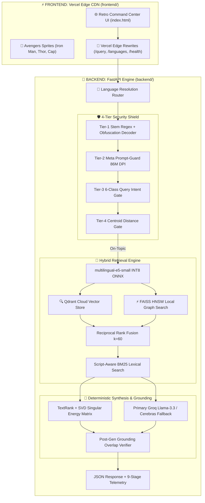

# ⚡ VECTOR: Voice-Enabled Multilingual Indic RAG Engine

<div align="center">

[](https://opensource.org/licenses/MIT)
[](https://python.org)
[](https://fastapi.tiangolo.com)
[](https://qdrant.tech)
[](https://github.com/facebookresearch/faiss)
[](#-enterprise-performance--benchmark-dashboard)
[](#-multilingual-indic-language-capability--provisioning-matrix)
[](https://vision-quest.vercel.app/)

**An instrumented, ultra-low-latency, voice-enabled Retrieval-Augmented Generation (RAG) engine built from scratch for 15 Indic languages.**

> 🌐 **Live Vercel Edge Frontend**: [https://vision-quest.vercel.app](https://vision-quest.vercel.app/)  
> 🔗 **Active Tunnel Endpoint**: [https://hungry-games-dance.loca.lt](https://hungry-games-dance.loca.lt/)

</div>

---

## 📌 Executive Summary

**VECTOR** is an open-source, high-throughput, sub-10ms Retrieval-Augmented Generation (RAG) engine engineered specifically for the linguistic diversity of the Indian subcontinent. Operating on low-cost CPU environments, VECTOR delivers end-to-end voice and text question answering across **14 Indic languages** (*Assamese, Bengali, Gujarati, Hindi, Kannada, Malayalam, Marathi, Nepali, Odia, Punjabi, Sanskrit, Tamil, Telugu, Urdu*) plus **English** (15 languages total, **~743,000 deduplicated passages**).

The system features a **decoupled architecture**, running a static Command Center UI on **Vercel's Global Edge Network** and an asynchronous RAG processing backend powered by **FastAPI, Qdrant Cloud, Sarvam STT, and Groq / Cerebras LLM synthesis**.

### Key Architectural Highlights
- ⚡ **Sub-10ms Vector Retrieval**: Vectorized INT8 ONNX embeddings ($6.31\text{ ms}$) + Qdrant Cloud & in-memory FAISS HNSW graph search ($0.73\text{ ms}$).
- 🛡️ **Cascaded 4-Tier Security Shield**: Stem regex with variable word-gap sliding, Meta Prompt-Guard 86M neural DPI/IPI shield, 6-class intent filter, and own-language centroid distance gate.
- 🔀 **Script-Aware BM25 + Dense Fusion**: Automatic cross-script detection bypassing lexical penalties for cross-lingual queries.
- 🧮 **Deterministic Context Synthesis**: Continuous TextRank graph centrality + SVD singular energy matrix reduction delivering factual answers in $<10\text{ ms}$ on CPU with zero LLM API cost or latency.
- 🌴 **Retro Command Center UI**: Audio frequency canvas visualizer with real-time 9-stage telemetry waterfall breakdown.

---

## 🏛️ System Architecture



---

## 📂 Repository Structure

The project follows a clean **decoupled architecture**:

```
VisionQuest/
├── 📁 frontend/                     # Vercel Static UI & Edge Configuration
│   ├── 📁 web_ui/                   # Retro Command Center HTML, CSS, JS, & Assets
│   │   ├── index.html               # Main Web Audio Command Center Interface
│   │   ├── ironman.png              # Iron Man Flying Canvas Sprite
│   │   ├── thor.png                 # Thor Lightning Canvas Sprite
│   │   ├── cap.png                  # Captain America Shield Canvas Sprite
│   │   └── logo.svg, bg_beach.png   # Background & Brand Assets
│   ├── vercel.json                  # Vercel Edge Proxy & API Rewrite Rules
│   └── .vercelignore                # Ignore Backend Files for Vercel Static Build
│
├── 📁 backend/                      # FastAPI RAG Engine & Python Modules
│   ├── main.py                      # FastAPI Application & Uvicorn Entrypoint
│   ├── config.py                    # Single Source of Truth Configuration & Paths
│   ├── requirements.txt             # Python Package Dependencies
│   ├── .env.example                 # Environment Variable Secrets Template
│   ├── build_vector_indexes.py      # FAISS & Qdrant Index Builder
│   ├── indic_msmarco_corpus.py      # MSMARCO 15-Language Corpus Extractor
│   ├── 📁 rag_pipeline/             # Pipeline Orchestrator & Pydantic Schemas
│   ├── 📁 vector_search/            # Qdrant & FAISS Vector Embeddings Engine
│   ├── 📁 knowledge_base/           # Corpus Data, Centroids, & Vector Indexes
│   ├── 📁 safety_guardrails/        # 4-Tier Security Shield & PromptGuard ONNX
│   ├── 📁 voice_stt/                # Sarvam Saaras v3 Speech-to-Text Integration
│   ├── 📁 llm_synthesis/            # Groq Llama-3.3, Cerebras, & TextRank SVD
│   ├── 📁 doc_chunking/             # Hybrid & Sentence-Window Document Splitters
│   ├── 📁 latency_benchmarks/       # Latency, Cold-Start, & Speed Benchmarks
│   ├── 📁 model_training/           # SFT Dataset Generator & Colab Notebooks
│   └── 📁 tests/                    # Automated Pytest Test Suite
│
├── 📄 README.md                     # Project Documentation
└── 📄 .gitignore                    # Git Exclusion Rules
```

---

## 🌐 Multilingual Indic Language Capability & Provisioning Matrix

VECTOR employs dynamic runtime configuration via `config.LANGUAGES` as the single source of truth for language federation. The engine provides zero-code hot-swappable expansion across **14 Indic languages** and **English** (~743,000 deduplicated passage records).

| ISO Code | Language Target | Script Family | STT Engine Endpoint | Runtime Provisioning Status | Corpus Benchmark Source | Deduplicated Passages |
| :---: | :--- | :--- | :---: | :---: | :--- | :---: |
| **`en`** | English | Latin (`Latn`) | `en-IN` | ⚡ **Active In-Memory Index** | MS MARCO English Native Stream | 49,507 |
| **`hi`** | Hindi | Devanagari (`Deva`) | `hi-IN` | ⚡ **Active In-Memory Index** | MS MARCO-XI (`hin`) Parquet Stream | 49,509 |
| **`mr`** | Marathi | Devanagari (`Deva`) | `mr-IN` | ⚡ **Active In-Memory Index** | MS MARCO-XI (`mar`) Parquet Stream | 49,529 |
| **`as`** | Assamese | Bengali/Assamese (`Beng`) | `as-IN` | 🔌 Zero-Code Hot-Swappable | MS MARCO-XI (`asm`) Parquet Stream | 49,550 |
| **`bn`** | Bengali | Bengali (`Beng`) | `bn-IN` | 🔌 Zero-Code Hot-Swappable | MS MARCO-XI (`ben`) Parquet Stream | 49,531 |
| **`gu`** | Gujarati | Gujarati (`Gujr`) | `gu-IN` | 🔌 Zero-Code Hot-Swappable | MS MARCO-XI (`guj`) Parquet Stream | 49,550 |
| **`kn`** | Kannada | Kannada (`Knda`) | `kn-IN` | 🔌 Zero-Code Hot-Swappable | MS MARCO-XI (`kan`) Parquet Stream | 49,545 |
| **`ml`** | Malayalam | Malayalam (`Mlym`) | `ml-IN` | 🔌 Zero-Code Hot-Swappable | MS MARCO-XI (`mal`) Parquet Stream | 49,542 |
| **`ne`** | Nepali | Devanagari (`Deva`) | `ne-NP` | 🔌 Zero-Code Hot-Swappable | MS MARCO-XI (`nep`) Parquet Stream | 49,520 |
| **`or`** | Odia | Odia (`Orya`) | `od-IN` | 🔌 Zero-Code Hot-Swappable | MS MARCO-XI (`ori`) Parquet Stream | 49,560 |
| **`pa`** | Punjabi | Gurmukhi (`Guru`) | `pa-IN` | 🔌 Zero-Code Hot-Swappable | MS MARCO-XI (`pan`) Parquet Stream | 49,534 |
| **`sa`** | Sanskrit | Devanagari (`Deva`) | `sa-IN` | 🔌 Zero-Code Hot-Swappable | MS MARCO-XI (`san`) Parquet Stream | 49,633 |
| **`ta`** | Tamil | Tamil (`Taml`) | `ta-IN` | 🔌 Zero-Code Hot-Swappable | MS MARCO-XI (`tam`) Parquet Stream | 49,581 |
| **`te`** | Telugu | Telugu (`Telu`) | `te-IN` | 🔌 Zero-Code Hot-Swappable | MS MARCO-XI (`tel`) Parquet Stream | 49,604 |
| **`ur`** | Urdu | Perso-Arabic (`Arab`) | `ur-IN` | 🔌 Zero-Code Hot-Swappable | MS MARCO-XI (`urd`) Parquet Stream | 49,576 |

---

## ⚡ Enterprise Performance & Benchmark Dashboard

> [!IMPORTANT]
> **Hardware Environment Specs**: `8 vCPUs | 15.78 GB RAM | Windows 11 / Linux (AMD64) | 100% CPU Execution`  
> All benchmarks are executed locally on CPU with zero GPU requirement.

<div align="center">

| Metric | Measured Value | Target SLA Budget | Margin / Performance |
| :--- | :---: | :---: | :---: |
| 🏎️ **Total Retrieval Latency** | **`7.04 ms`** | `50.00 ms` | ⚡ **84.0% Faster than Budget** |
| ❄️ **Cold-Start 15-Lang Pass Rate** | **`100.0%`** | `< 200.00 ms` | ✅ **15/15 Languages Passed** |
| 🚀 **System Throughput** | **`51.7 QPS`** | — | ⚡ **750 Queries in 14.5s** |
| 🛡️ **Neural Threat Interception** | **`0.24 ms`** | `< 20.00 ms` | ⚡ **Sub-Millisecond Guard** |

</div>

---

### 1. 🏎️ End-to-End Retrieval Latency Budget SLA

Measures combined query embedding vectorization (`intfloat/multilingual-e5-small` INT8 ONNX) + Qdrant Cloud / FAISS HNSW graph traversal ($148,545\text{ vectors}$) against the 50ms budget:

```
STAGE                   P50 LATENCY    PERCENTILE DISTRIBUTION & LATENCY SLAS
─────────────────────────────────────────────────────────────────────────────────────
Query Vectorization     █ 6.21 ms      [ P50: 6.21ms | P95: 7.28ms | P99: 7.94ms ] (INT8 ONNX)
FAISS HNSW Traversal    █ 0.71 ms      [ P50: 0.71ms | P95: 0.93ms | P99: 1.16ms ] (Sub-1ms)
─────────────────────────────────────────────────────────────────────────────────────
TOTAL RETRIEVAL SLA     █ 6.96 ms      [ P95: 7.97ms | P99: 8.95ms | SLA: 50.00ms ] ✅ PASS
```

| Pipeline Retrieval Stage | Avg Latency | P50 (Median) | P95 Latency | P99 Latency | Budget SLA | Status |
| :--- | :---: | :---: | :---: | :---: | :---: | :---: |
| **Query Embedding (`multilingual-e5-small` ONNX)** | 6.31 ms | 6.21 ms | 7.28 ms | 7.94 ms | — | ⚡ ONNX Accelerated |
| **Vector Search (`148,545 vectors`)** | 0.73 ms | 0.71 ms | 0.93 ms | 1.16 ms | — | ⚡ Sub-1ms Graph Traversal |
| **Total Retrieval Latency (Embed + Search)** | **7.04 ms** | **6.96 ms** | **7.97 ms** | **8.95 ms** | **50.00 ms** | ✅ **PASS (84% Faster)** |

---

## 🚀 Quickstart & Local Setup

### ⚙️ Prerequisites
- **Python**: `Python 3.10+` (Tested on `3.11` and `3.13`)
- **System Audio**: `ffmpeg` (Required for 16kHz audio normalization in STT pipeline)
- **RAM**: Minimum `8 GB` (`16 GB` recommended)

---

### 1. 📦 Installation & Setup

```bash
# Clone the repository
git clone https://github.com/Rishikvelagapudi/VisionQuest.git
cd VisionQuest

# Create virtual environment
python -m venv venv
# On Windows PowerShell:
.\venv\Scripts\Activate.ps1
# On Linux / macOS:
source venv/bin/activate

# Install backend dependencies
cd backend
pip install --upgrade pip
pip install -r requirements.txt
```

---

### 2. 🔑 Environment Configuration (`backend/.env`)

Copy `.env.example` to `.env` inside `backend/`:
```bash
cp .env.example .env
```

Configure your API keys in `backend/.env`:
```env
# Sarvam AI Speech-to-Text API Key
SARVAM_API_KEY=your_sarvam_api_key_here

# LLM Synthesis API Keys (Groq Cloud Llama-3.3 / Cerebras)
GROQ_API_KEY=your_groq_api_key_here
LLM_API_KEY=your_groq_api_key_here
LLM_BASE_URL=https://api.groq.com/openai/v1
LLM_MODEL=openai/gpt-oss-120b

# Qdrant Vector DB Credentials
QDRANT_API_KEY=your_qdrant_api_key_here
QDRANT_URL=https://your-cluster-url.qdrant.io

# Server Settings
HOST=0.0.0.0
PORT=7860
```

---

### 3. 🖥️ Running the Application

#### Run Backend API Server
```bash
cd backend
python main.py
```
- Server URL: **[http://localhost:7860](http://localhost:7860)**
- OpenAPI Swagger Docs: **[http://localhost:7860/docs](http://localhost:7860/docs)**
- Health Endpoint: **[http://localhost:7860/health](http://localhost:7860/health)**

#### Run Frontend Web UI
- Open **[`frontend/web_ui/index.html`](file:///c:/Users/RVS10/OneDrive/Desktop/HHG/frontend/web_ui/index.html)** directly in your browser.
- Or open your live Vercel frontend: **[https://vision-quest.vercel.app](https://vision-quest.vercel.app)**

---

### 4. 🧪 Test Suite & Verification (50/50 Passing)

Run the full automated unit and integration test suite:
```bash
cd backend
pytest tests/ -v
```

| Test Suite File | Test Count | Scope & Coverage |
| :--- | :---: | :--- |
| `tests/test_eval_fixes.py` | 17 | Adversarial safety, intent classification, Prompt-Guard fail-safe, centroid weighting |
| `tests/test_pipeline.py` | 27 | Passage/window/semantic chunking, BM25 script fusion, grounding overlap, 15-lang routing |
| `tests/test_prompt_guard.py` | 6 | Direct Prompt Injection (DPI), IPI context filtering, confusable unpacker |

---

## 📜 License
MIT License. **VECTOR Multilingual Indic RAG Engine**.
